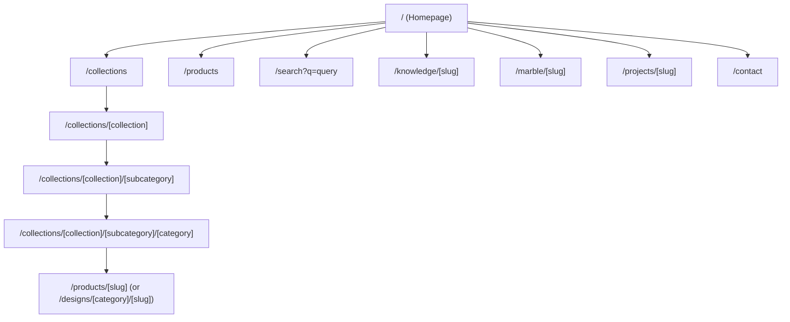

# Technical Architecture & Codebase Audit Report: Jaipur Stonecraft

**Audit Date:** August 14, 2026  
**Target Scope:** Next.js Codebase Architecture ([`d:\jsc\jsc web1`](file:///d:/jsc/jsc%20web1))  
**Objective:** Comprehensive analysis of the current website structure, data models, routing, SEO, media pipeline, and backend state to prepare for the upcoming lightweight private admin/dashboard system and real product data integration.

---

## 1. Project & Technology Overview

| Architecture Layer | Current Technology / Implementation | Details |
| :--- | :--- | :--- |
| **Framework & Version** | Next.js `16.3.0` | Next.js App Router paradigm (`app/` directory). |
| **Programming Language** | JavaScript (ES6+ / Node.js) | Pure JavaScript with standard JSDoc annotations (No TypeScript). |
| **Routing System** | Next.js App Router | Dynamic folder-based routing with parameterized route segments (`[slug]`, `[collection]`, `[subcategory]`, `[category]`). |
| **UI & Component Architecture** | React `19.2.8` | Server & Client Components (`"use client"` directive used selectively for forms and interactive search). |
| **Styling Approach** | Vanilla CSS + CSS Modules | Custom design token system defined in [`styles/globals.css`](file:///d:/jsc/jsc%20web1/styles/globals.css) coupled with scoped `*.module.css` component files. Zero Tailwind dependencies. |
| **State Management** | React Local State (`useState`) | Component-level state only. No global state managers (Redux, Zustand, React Query) are currently installed or needed for the public site. |
| **Backend & API Architecture** | Minimal App Router Route Handlers | No `/api/` endpoints exist for products, categories, or inquiries. The only active route handler is [`app/llms.txt/route.js`](file:///d:/jsc/jsc%20web1/app/llms.txt/route.js). |
| **Database & ORM Layer** | In-Memory JavaScript Objects | No relational (PostgreSQL, MySQL) or document (MongoDB) database is connected. Data is held in JS objects in [`content/products-db/`](file:///d:/jsc/jsc%20web1/content/products-db). |
| **Authentication** | None Implemented | Zero auth routes, session tokens, JWT, or role-based access control exist in the codebase. |
| **Image & Media Handling** | Next.js Image (`next/image`) + Mock Dynamic Placeholders | Uses [`next/image`](file:///d:/jsc/jsc%20web1/next.config.mjs) configured for WebP/AVIF generation. Images currently point to `placehold.co` mock URLs. |
| **Hosting & Configuration** | Node.js Standard / Next Dev Server | Configured in [`next.config.mjs`](file:///d:/jsc/jsc%20web1/next.config.mjs) with local network origin support (`192.168.29.36`). |

---

## 2. Project Folder Structure

```
d:\jsc\jsc web1\
├── app/                              # Next.js App Router pages and dynamic routes
│   ├── collections/                  # 3-Tier Collection taxonomy pages
│   │   ├── page.js                   # Collections overview index page
│   │   └── [collection]/             # Level 1 Collection page
│   │       └── [subcategory]/        # Level 2 Subcategory page
│   │           └── [category]/       # Level 3 Category page (Product grid)
│   ├── products/                     # Product catalog pages
│   │   ├── page.js                   # All products directory listing
│   │   └── [slug]/                   # Dynamic single product detail page
│   ├── search/                       # Search & filtering interface
│   ├── contact/                      # Contact and custom inquiry page
│   ├── craftsmanship/                # Stone carving & heritage page
│   ├── custom-projects/             # Bespoke commission inquiry page
│   ├── export/                       # Global packing & logistics page
│   ├── knowledge/                    # Educational knowledge hub ([slug])
│   ├── marble/                       # Material guide hub ([slug])
│   ├── our-story/                    # Brand history and atelier lineage
│   ├── projects/                     # Portfolio project showcase ([slug])
│   ├── layout.js                     # Root layout (Fonts, Header, Footer, Organization Schema)
│   ├── page.js                       # Homepage
│   ├── robots.js                     # Dynamic robots.txt handler
│   └── sitemap.js                    # Dynamic sitemap.xml generator
├── components/                       # UI Component Library (35 modular components)
│   ├── CategoryCard/                 # Category grid card UI
│   ├── CollectionCard/               # Top-level collection card UI
│   ├── ContactForm/                  # Client-side validation & submission form
│   ├── Footer/                       # Site-wide footer with links & schema
│   ├── Gallery/                      # Product detail image gallery viewer
│   ├── Header/                       # Main navigation bar with overlay trigger
│   ├── ProductCard/                  # Product grid display card
│   ├── Search/                       # Interactive search bar & results grid
│   └── ... (35 total folders)
├── content/                          # Static Data Layer & Database Provider Engine
│   ├── products-db/                  # Unified In-Memory Product Database Engine
│   │   ├── index.js                  # Central re-exporter API
│   │   ├── products-db.js            # Synthesized 386-design store + Query Engine
│   │   ├── categories-db.js          # Normalized category lookup tables
│   │   ├── materials-db.js           # Natural stone taxonomy (Granite strictly excluded)
│   │   ├── subjects-db.js            # Sacred deity & artistic subject entity store
│   │   ├── images-db.js              # Image roles & structured image metadata builder
│   │   ├── quality-db.js             # Material quality & finishing specs
│   │   └── knowledge-db.js           # Educational knowledge articles
│   ├── schema/                       # Data Model & Schema Definitions
│   │   └── schema-definition.js      # Canonical schema specification & enums
│   ├── categories.js                 # Category definitions map
│   ├── collections.js                # Top-level collections hierarchy map
│   ├── marble.js                     # Marble material hub content
│   └── projects.js                   # Portfolio projects data
├── lib/                              # Business Logic, DB Wrappers & SEO Utilities
│   ├── db/                           # DB Helper Interface
│   │   ├── index.js                  # Central exporter
│   │   ├── products.js               # Query wrappers (getProductBySlug, queryProductsDB)
│   │   ├── taxonomy.js               # Category and collection lookups
│   │   └── materials.js              # Material filter queries
│   └── seo/                          # SEO Utilities
│       ├── metadata.js               # OpenGraph & Page Metadata builder
│       └── schemas.js                # JSON-LD Schema Generators (Product, Organization, etc.)
├── public/                           # Static assets (Favicons, public images)
├── styles/                           # Design Tokens & Global CSS
│   └── globals.css                   # Core CSS tokens (colors, typography, container clamp)
├── next.config.mjs                   # Next.js configuration & allowed image domains
└── package.json                      # Project dependencies & scripts
```

### Folder Purpose Summary
* **`app/`**: Handles all route resolution, page layout assembly, and server-side metadata generation.
* **`content/`**: Acts as the current mock backend. Synthesizes catalog records dynamically using JavaScript loops over predefined taxonomies.
* **`lib/db/`**: Exposes query functions (`queryProductsDB`, `getRelatedProductsFromDB`, `getProductsByCollection`) that simulate SQL database queries over the in-memory JavaScript objects.
* **`lib/seo/`**: Standardizes SEO metadata and JSON-LD structured data generation across all dynamic routes.

---

## 3. Current Website Pages & Routing

The application implements a 5-tier dynamic routing hierarchy.



### Implemented Public Routes
1. **Homepage (`/`)** — [`app/page.js`](file:///d:/jsc/jsc%20web1/app/page.js): Hero banner, featured collections, trust indicators, heritage craftsmanship overview, and featured products.
2. **Product Catalog Listing (`/products`)** — [`app/products/page.js`](file:///d:/jsc/jsc%20web1/app/products/page.js): Comprehensive list of all published products with search and filtering.
3. **Single Product Detail Page (`/products/[slug]`)** — [`app/products/[slug]/page.js`](file:///d:/jsc/jsc%20web1/app/products/[slug]/page.js): Complete detail view featuring image gallery, material options, dimensions, Shilpa Shastra knowledge layer, and related product recommendations.
4. **Collections Overview (`/collections`)** — [`app/collections/page.js`](file:///d:/jsc/jsc%20web1/app/collections/page.js): Top-level card grid of major portfolio categories.
5. **Level 1 Collection Page (`/collections/[collection]`)** — [`app/collections/[collection]/page.js`](file:///d:/jsc/jsc%20web1/app/collections/[collection]/page.js).
6. **Level 2 Subcategory Page (`/collections/[collection]/[subcategory]`)** — [`app/collections/[collection]/[subcategory]/page.js`](file:///d:/jsc/jsc%20web1/app/collections/[collection]/[subcategory]/page.js).
7. **Level 3 Category Page (`/collections/[collection]/[subcategory]/[category]`)** — [`app/collections/[collection]/[subcategory]/[category]/page.js`](file:///d:/jsc/jsc%20web1/app/collections/[collection]/[subcategory]/[category]/page.js): Full product grid filtered by explicit category.
8. **Search & Filter Page (`/search`)** — [`app/search/page.js`](file:///d:/jsc/jsc%20web1/app/search/page.js): Multi-attribute search interface with live query string resolution.
9. **Craftsmanship & Story Pages (`/craftsmanship`, `/our-story`)** — Brand heritage, masonic carving techniques, and artisan lineage.
10. **Custom Commissions & Export (`/custom-projects`, `/export`)** — Architectural service details and international export packing specifications.
11. **Contact & Inquiry (`/contact`)** — [`app/contact/page.js`](file:///d:/jsc/jsc%20web1/app/contact/page.js): Form interface with pre-fill parameters for specific products.

---

## 4. Current Product Architecture

### Data Source & Storage Method
Product data is **100% in-memory and dynamically generated in code**.
* Product records are built inside [`content/products-db/products-db.js`](file:///d:/jsc/jsc%20web1/content/products-db/products-db.js).
* An array loop iterates through `categoriesData` ([`content/categories.js`](file:///d:/jsc/jsc%20web1/content/categories.js)) and populates `productsDatabaseStore` with **386 calculated product records**.
* There is no underlying JSON file for products, nor any SQL/NoSQL database connection.

### Product Data Model Fields
Defined canonical schema in [`content/schema/schema-definition.js`](file:///d:/jsc/jsc%20web1/content/schema/schema-definition.js):
* **Identity:** `id`, `sku`, `slug`, `name`, `status` (`published` | `draft` | `archived`), `isFeatured`, `isNewArrival`, `isCustomOnly`.
* **Taxonomy:** `productType`, `parentCollection`, `parentSubcategory`, `parentCategory`.
* **Entity Relationships:** `subjectId`, `subjectObj`, `primaryMaterialId`, `primaryMaterial`, `compatibleMaterials`.
* **Content:** `shortDescription`, `detailedDescription`, `knowledgeLayer` (`whatIsThis`, `materialOrigin`, `suitableFor`, `installationCare`, `customizationOptions`).
* **Media:** `imageSrc`, `imageGallery` (arrays of URLs), structured `ImageRecord` objects.
* **Technical Attributes:** `colorFamily`, `finish`, `environment`, `availableDimensions` (height, width, depth).
* **Tags & Search Aliases:** `tags` (e.g., `["Single-Block-Marble", "Shilpa-Shastra-Proportioned"]`).
* **SEO Metadata:** `seo` object (`title`, `description`, `keywords`).

### Query & Recommendation Engine
Located in [`content/products-db/products-db.js`](file:///d:/jsc/jsc%20web1/content/products-db/products-db.js):
1. **`queryProductsDB()`**: A custom 7-tier weighted multi-term search algorithm supporting filtering by collection, material, product type, and subject, with built-in intelligent fallback matching.
2. **`getRelatedProductsFromDB()`**: Calculates recommendations based on weighted scoring: Shared Subject (+10 pts), Shared Category (+5 pts), Shared Primary Material (+3 pts), Shared Collection (+1 pt).

---

### 3 Representative Product Data Examples

#### Example 1: Sacred Deity Idol (Makrana White Marble)
```javascript
{
  id: "seated-ganesh-with-modak",
  sku: "JSC-GANE-SEAT",
  slug: "seated-ganesh-with-modak",
  name: "Seated Ganesh with Modak",
  status: "published",
  isFeatured: true,
  productType: "idol",
  parentCategory: "ganesh-ji",
  parentSubcategory: "hindu-sculptures",
  parentCollection: "sculptures-statues",
  subjectId: "ganesh",
  primaryMaterialId: "makrana-pure-white",
  primaryMaterial: {
    id: "makrana-pure-white",
    name: "Makrana Pure White Marble",
    colorFamily: "White",
    durability: "All-Weather Exterior Landscape & Sacred Sanctuary"
  },
  shortDescription: "Hand-carved Seated Ganesh with Modak crafted by master stone artisans in Jaipur.",
  imageSrc: "https://placehold.co/800x600/E8E4DF/1A1918?text=Seated+Ganesh+with+Modak",
  attributes: {
    colorFamily: "White",
    finish: "Hand Honed (Natural Matte)",
    environment: "All-Weather Exterior Landscape & Sacred Sanctuary",
    availableDimensions: [
      { heightInches: 24, heightFeetLabel: "2.0 Feet", customizable: true },
      { heightInches: 42, heightFeetLabel: "3.5 Feet", customizable: true }
    ]
  },
  tags: ["Single-Block-Marble", "Shilpa-Shastra-Proportioned", "Pooja-Room-Idol"]
}
```

#### Example 2: Architectural Element (Pink Bansi Sandstone)
```javascript
{
  id: "geometric-star-pattern-jali",
  sku: "JSC-JALI-GEOM",
  slug: "geometric-star-pattern-jali",
  name: "Geometric Star Pattern Jali",
  status: "published",
  isFeatured: true,
  productType: "architectural_element",
  parentCategory: "jali-screens",
  parentSubcategory: "architectural-elements",
  parentCollection: "temples-architectural-stonework",
  subjectId: "jali-lattice",
  primaryMaterialId: "pink-bansi-paharpur",
  primaryMaterial: {
    id: "pink-bansi-paharpur",
    name: "Pink Bansi Paharpur Sandstone",
    colorFamily: "Pink"
  },
  shortDescription: "Hand-carved Geometric Star Pattern Jali crafted by master stone artisans in Jaipur.",
  imageSrc: "https://placehold.co/800x600/E8E4DF/1A1918?text=Geometric+Star+Pattern+Jali",
  attributes: {
    colorFamily: "Pink",
    finish: "Hand Honed (Natural Matte)",
    customizable: true
  },
  tags: ["Perforated-Screen", "Rajasthani-Architecture", "Custom-Dimension"]
}
```

#### Example 3: Wall Relief Mural (Dholpur Beige Sandstone)
```javascript
{
  id: "traditional-wall-art-reliefs",
  sku: "JSC-WALL-TRAD",
  slug: "traditional-wall-art-reliefs",
  name: "Traditional Wall Art & Reliefs",
  status: "published",
  isFeatured: false,
  productType: "relief",
  parentCategory: "religious-spiritual-reliefs",
  parentSubcategory: "spiritual-murals",
  parentCollection: "wall-art-reliefs",
  primaryMaterialId: "dholpur-beige-sandstone",
  primaryMaterial: {
    id: "dholpur-beige-sandstone",
    name: "Dholpur Beige Sandstone",
    colorFamily: "Beige"
  },
  shortDescription: "Hand-carved Traditional Wall Art & Reliefs crafted by master stone artisans in Jaipur.",
  imageSrc: "https://placehold.co/800x600/E8E4DF/1A1918?text=Traditional+Wall+Art+%26+Reliefs",
  attributes: {
    colorFamily: "Beige",
    environment: "All-Weather Exterior Landscape"
  },
  tags: ["Stone-Wall-Mural", "Heritage-Panel"]
}
```

---

## 5. Current Category / Collection Architecture

Taxonomy hierarchy is defined across [`content/collections.js`](file:///d:/jsc/jsc%20web1/content/collections.js) and [`content/categories.js`](file:///d:/jsc/jsc%20web1/content/categories.js).

```
Level 1: Collections (e.g., "sculptures-statues", "temples-architectural-stonework")
   └── Level 2: Subcategories (e.g., "hindu-sculptures", "home-mandirs")
        └── Level 3: Categories (e.g., "ganesh-ji", "shiva-ji", "jali-screens")
             └── Level 4: Products / Designs (e.g., "seated-ganesh-with-modak")
                  └── Level 5: Technical Variants (Materials, Dimensions, Finishes)
```

### Classification Capabilities & Limitations
* **Primary Classification:** Strictly hierarchical (Single parent collection $\rightarrow$ single subcategory $\rightarrow$ single category).
* **Secondary Groupings:** `curatedCollectionSlugs` and `secondaryCategorySlugs` fields exist in schema definitions, but are not currently stored in real database tables.
* **Strict Rule Enforced:** Granite is **strictly excluded** across all categories, materials, and product descriptions per architectural design rules.

---

## 6. Current Database Schema & Relationships

The logical database model is fully specified in [`content/schema/schema-definition.js`](file:///d:/jsc/jsc%20web1/content/schema/schema-definition.js).

```
                  ┌─────────────────────────┐
                  │    CollectionsData      │
                  └────────────┬────────────┘
                               │ 1:N
                  ┌────────────▼────────────┐
                  │     Subcategories       │
                  └────────────┬────────────┘
                               │ 1:N
                  ┌────────────▼────────────┐
                  │     CategoriesData      │
                  └────────────┬────────────┘
                               │ 1:N
┌──────────────────┐           │           ┌──────────────────┐
│   SubjectsDB     │◄──────────┼──────────►│   MaterialsDB    │
│  (Deity/Entity)  │ 0..1:N    │    1:N    │ (Natural Stone)  │
└──────────────────┘           │           └──────────────────┘
                               │
                    ┌──────────▼──────────┐
                    │  ProductsDBStore    │
                    │   (386 Products)    │
                    └──────────┬──────────┘
                               │
       ┌───────────────────────┼───────────────────────┐
  1:N  │                  1:N  │                  1:N  │
┌──────▼──────┐         ┌──────▼──────┐         ┌──────▼──────┐
│  ImageSet   │         │ Attributes  │         │ Knowledge   │
│(8 roles/img)│         │(Dimensions) │         │  Layer      │
└─────────────┘         └─────────────┘         └─────────────┘
```

---

## 7. Current Image & Media System

### Current Implementation
* **Image Sources:** All images are currently pointed to external mock placeholders: `https://placehold.co/800x600/...` or `1200x900/...`.
* **Structured Image Record Builder:** [`content/products-db/images-db.js`](file:///d:/jsc/jsc%20web1/content/products-db/images-db.js) defines an `ImageRoleEnum` with 8 explicit roles: `hero`, `front`, `side`, `detail`, `scale_reference`, `craftsmanship_process`, `installation`, `thumbnail`.
* **Next.js Image Config:** [`next.config.mjs`](file:///d:/jsc/jsc%20web1/next.config.mjs) allows `placehold.co` domain and specifies format optimization for AVIF and WebP formats (`formats: ["image/avif", "image/webp"]`).
* **Alt Text:** Automated SEO-descriptive alt text generation is implemented (e.g., `"Makrana Pure White Marble Seated Ganesh with Modak hand-carved in Jaipur atelier"`).

### Key Gaps for Phase 2
* **No Real Asset Storage:** No local product images (`/public/images/products/`) or cloud bucket (AWS S3, Cloudinary) integration exists yet.
* **No Image Upload API:** There is no server endpoint for uploading, resizing, or organizing image assets.

---

## 8. SEO Architecture

### Implementation Breakdown

#### Already Implemented
* **Dynamic Page Titles & Descriptions:** Standardized via [`lib/seo/metadata.js`](file:///d:/jsc/jsc%20web1/lib/seo/metadata.js).
* **Canonical URLs:** Auto-generated on all page templates.
* **Dynamic XML Sitemap:** Automatically compiles static pages, knowledge articles, marble hubs, collections, categories, and all 386 products in [`app/sitemap.js`](file:///d:/jsc/jsc%20web1/app/sitemap.js).
* **Dynamic Robots.txt:** Configured via [`app/robots.js`](file:///d:/jsc/jsc%20web1/app/robots.js).
* **JSON-LD Schema Markup:** [`lib/seo/schemas.js`](file:///d:/jsc/jsc%20web1/lib/seo/schemas.js) implements `@type: LocalBusiness`, `@type: VisualArtwork`, `@type: Product`, `@type: AggregateOffer` (with "Upon Request" pricing), and `@type: BreadcrumbList`.
* **SEO Clean Slugs:** Descriptive, semantic URL structures.

#### Partially Implemented
* **Image OpenGraph Meta:** Default fallback image configured; needs real artwork photos.

#### Missing
* **Redirect Engine:** No automated `301` redirect handling table for renamed slugs or archived products.

---

## 9. Performance & Efficiency Review

| Area | Impact Level | Observed Issue / Finding |
| :--- | :--- | :--- |
| **In-Memory JavaScript Data Bundle** | **Critical Concern** | All 386 product records, material objects, and subject taxonomy files are bundled into server memory and loaded on every page import. Adding 1,000+ products in JavaScript memory will inflate Node.js memory footprint and slow down initial server startup/SSR build times. |
| **Client-Side Search Bundle** | **Important Concern** | Search on [`app/search/page.js`](file:///d:/jsc/jsc%20web1/app/search/page.js) executes in JS memory on the server/client. For 1,000+ items, running un-indexed array filters on client components will cause rendering latency on mobile browsers. |
| **Placeholder Image Overhead** | **Minor Concern** | All images request external `placehold.co` assets. Once real compressed WebP/AVIF images are hosted on a CDN or local static storage, load times will improve significantly. |
| **CSS Modules & Web Fonts** | **No Concern** | Google Fonts (`Cormorant Garamond`, `Inter`) are optimized via `next/font/google` with `display: swap`. CSS tokens are lightweight and clean. |

---

## 10. Existing Admin / Management Capabilities

* **Authentication:** **0%** — No login screen, no auth middleware, no user roles (Admin/Editor).
* **Admin Routes:** **0%** — No `/admin` or `/dashboard` directory in `app/`.
* **Product CRUD APIs:** **0%** — No REST API or Server Actions to `CREATE`, `READ`, `UPDATE`, or `DELETE` products.
* **Image Upload Pipeline:** **0%** — No file upload input or file system write routes.
* **Database System:** **0%** — No persistent database file (SQLite/PostgreSQL) attached yet.

---

## 11. Product Inquiry / Contact Data Flow

* **Inquiry Components:** [`components/ContactForm/ContactForm.js`](file:///d:/jsc/jsc%20web1/components/ContactForm/ContactForm.js) handles client-side state, validation rules, and context inputs (`defaultCategory`, `defaultProduct`).
* **Current Data Destination:** Submissions simulate network latency (`setTimeout(1500)`), log payload to the browser console (`console.log("Mock Form Submission Data:", formData)`), and display a UI success screen.
* **Data Storage / Email Dispatch:** **Not yet wired.** Submitted forms are not stored in any database, nor emailed via SMTP/Resend/SendGrid.

---

## 12. Scalability Assessment

```
Current State (386 Synthesized Products in JS)  ----> Fully functional in-memory
100–500 Real Products                           ----> Moderate memory footprint; JS object filtering manageable
1,000+ Products + Multiple Hi-Res Photos         ----> Requires persistent SQLite / PostgreSQL DB + Cloud CDN
```

### Key Bottlenecks for 1,000+ Products
1. **Memory & Build Time:** Storing 1,000+ full product JSON records in JavaScript memory will make dynamic updates require server restarts or re-deployments.
2. **Search Latency:** Array `filter()` and `sort()` operations over thousands of nested items will benefit from a dedicated SQLite indexed query engine (e.g. `Prisma` + `SQLite` or `PostgreSQL`).
3. **Media Pipeline:** Storing high-res product photos locally in `/public/` will bloat git repository size. An image management endpoint with auto-compression (WebP/AVIF) or CDN integration will be required.

---

## 13. Final Summary

### A. What is already working well and should be preserved
1. **Design System & Aesthetics:** Sleek, high-end stone atelier UI built with vanilla CSS tokens ([`styles/globals.css`](file:///d:/jsc/jsc%20web1/styles/globals.css)) and Google Fonts (`Cormorant Garamond`).
2. **Schema & Taxonomy Model:** The schema in [`content/schema/schema-definition.js`](file:///d:/jsc/jsc%20web1/content/schema/schema-definition.js) and 5-tier classification hierarchy are well-structured and reflect authentic stonecraft specifications.
3. **SEO Infrastructure:** Dynamic sitemap, metadata helpers, canonical URLs, and JSON-LD structured data (`VisualArtwork`, `Product`, `Organization`) are already cleanly integrated.
4. **Search & Recommendation Logic:** The 7-tier search scoring and weighted product recommendation engine work effectively.

### B. What can be reused for the upcoming product management system
1. **Schema Definitions:** The entity interfaces in [`schema-definition.js`](file:///d:/jsc/jsc%20web1/content/schema/schema-definition.js) can serve directly as the database schema (SQLite tables or Prisma schema) for the admin dashboard.
2. **Taxonomy & Material Records:** The curated material taxonomy (`materials-db.js`) and sacred subject taxonomy (`subjects-db.js`) can be reused directly as dropdown option lookups in admin forms.
3. **SEO & Metadata Builders:** All existing metadata and schema generator functions ([`lib/seo/`](file:///d:/jsc/jsc%20web1/lib/seo)) can consume records directly from the new database without UI component refactoring.

### C. What may need modification before building the admin system
1. **Data Layer Transition:** Move from in-memory JS objects in [`content/products-db/products-db.js`](file:///d:/jsc/jsc%20web1/content/products-db/products-db.js) to a lightweight persistent database (such as SQLite with Prisma or Drizzle ORM).
2. **DB Query Abstraction:** Update [`lib/db/products.js`](file:///d:/jsc/jsc%20web1/lib/db/products.js) query functions so they query the persistent database instead of `productsDatabaseStore`.

### D. Potential risks or technical concerns
1. **No Data Loss on Migration:** Ensure all existing 386 product records and category relationships are migrated accurately into the new database file before disabling the mock generator.
2. **Granite Rule Enforcement:** The admin system must maintain the strict validation rule excluding Granite from material dropdowns and product inputs.
3. **Image Asset Storage:** Storing high-resolution photos in git will inflate repository size; an admin file upload route to local persistent storage or an asset bucket is recommended.

---

### Conclusion & Next Step
The current website codebase is clean, performant, and architecturally well-organized. You are in a strong position to introduce a lightweight persistent database (e.g., SQLite) and a private admin dashboard without needing to break or rebuild the public user interface.
